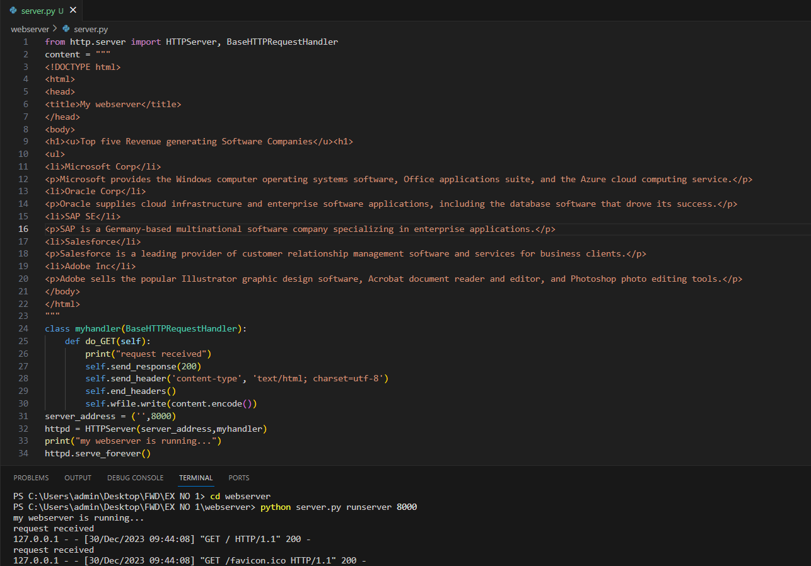
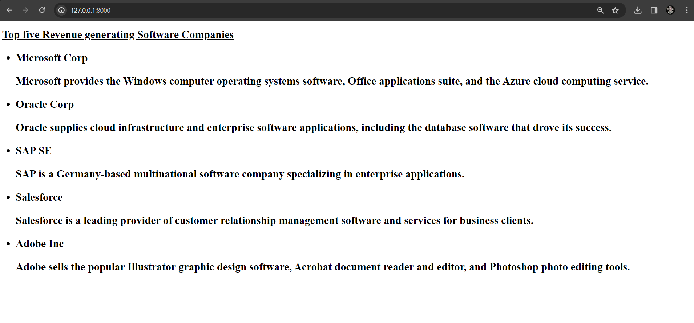

# Developing a Simple Webserver

# Name : P.Bharathraj
# Ref  : 212223230031

# AIM:

To develop a simple webserver to serve html programming pages.

## DESIGN STEPS:

### Step 1:

HTML content creation is done

### Step 2:

Design of webserver workflow

### Step 3:

Implementation using Python code

### Step 4:

Serving the HTML pages.

### Step 5:

Testing the webserver

## PROGRAM:
```
from http.server import HTTPServer, BaseHTTPRequestHandler
content = """
<!DOCTYPE html>
<html>
<head>
<title>My webserver</title>
</head>
<body>
<h1><u>Top five Revenue generating Software Companies</u><h1>
<ul>
<li>Microsoft Corp</li>
<p>Microsoft provides the Windows computer operating systems software, Office applications suite, and the Azure cloud computing service.</p>
<li>Oracle Corp</li>
<p>Oracle supplies cloud infrastructure and enterprise software applications, including the database software that drove its success.</p>
<li>SAP SE</li>
<p>SAP is a Germany-based multinational software company specializing in enterprise applications.</p>
<li>Salesforce</li>
<p>Salesforce is a leading provider of customer relationship management software and services for business clients.</p>
<li>Adobe Inc</li>
<p>Adobe sells the popular Illustrator graphic design software, Acrobat document reader and editor, and Photoshop photo editing tools.</p>
</body>
</html>
"""
class myhandler(BaseHTTPRequestHandler):
    def do_GET(self):
        print("request received")
        self.send_response(200)
        self.send_header('content-type', 'text/html; charset=utf-8')
        self.end_headers()
        self.wfile.write(content.encode())
server_address = ('',8000)
httpd = HTTPServer(server_address,myhandler)
print("my webserver is running...")
httpd.serve_forever()
```

## OUTPUT:



## RESULT:
The program is executed succesfully
